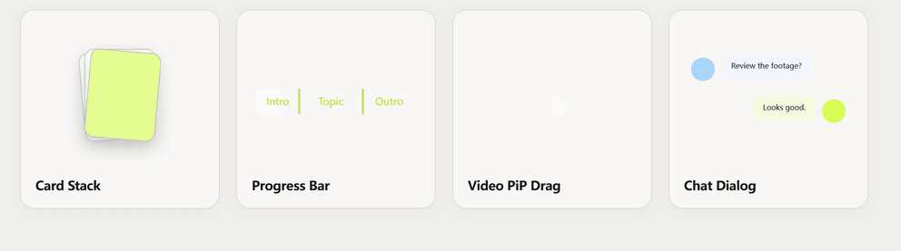

# Motion Assets

A browser-local tool for creating animated assets with a real alpha channel — export transparent ProRes 4444 MOVs and drop them straight into CapCut / JianYing as overlay effects. Nothing is uploaded; everything renders locally.



## Assets

- **Card Stack** — stack 2–8 images, tune order and motion parameters, export.
- **Image Lineup** — alternate images in from below and above into fixed positions in a centered row.
- **Progress Bar** — chapter labels on timestamps, adjustable ticks, thickness and color, five aspect ratios.
- **Chat Dialog** — left/right conversation with avatars, bubble colors, fonts and reveal timing.
- **Video PiP Drag** — a cursor drags open a video rectangle (up to 15 s), ratio-preserving, silent output.
- **Blur Text** — reveal words from blur with adjustable timing, font, and color.
- **Count Up** — animate formatted values with prefixes, suffixes, and decimals.
- **Logo Loop** — loop uploaded SVG/transparent images or the bundled ChatGPT, Claude, Grok, and Gemini logos.
- **Mermaid Flow** — paste a `flowchart` with `LR`, `RL`, `TD`, `TB`, or `BT` direction and animate its nodes, connections, and arrows in sequence.

All assets share the same preview and export path: what you see is the MOV you get.

## Batch import

Drop a JSON file or a ZIP containing one JSON manifest plus referenced media anywhere on the page. The fixed **+** button opens the same importer. Imported instances appear in order in a scrollable workspace and remain fully editable.

```json
{
  "version": 1,
  "instances": [
    {
      "id": "launch-cards",
      "motion": "card-stack",
      "format": "16:9",
      "parameters": { "animationSpeed": 1.2, "holdDuration": 2 },
      "assets": ["media/card-1.png", "media/card-2.png"]
    },
    {
      "motion": "logo-loop",
      "parameters": { "direction": "right" }
    }
  ]
}
```

Paths in `assets` are relative to the manifest inside the ZIP. A plain JSON file can omit media and use each instance's normal upload controls. Logo Loop uses its built-in logos when `assets` is omitted.

## Run locally

```bash
npm install
npm run dev
```

Preview and export share one Canvas renderer; MOV frames are rendered and encoded in a Web Worker with [`prores-wasm-encoder`](https://www.npmjs.com/package/prores-wasm-encoder).

## Verification

```bash
npm run verify
```

The automated test generates a small real MOV and validates its QuickTime container, ProRes 4444 codec marker, dimensions, frame rate, duration, and alpha-bearing pixel format with `ffprobe` when available.

## Contributing

Have an idea or a demo? Start a [Discussion](https://github.com/DanielDaniel2201/motion-assets/discussions). Found a bug? Open an [Issue](https://github.com/DanielDaniel2201/motion-assets/issues). Ready to contribute an implementation? Read [CONTRIBUTING.md](CONTRIBUTING.md), fork the repository, and open a pull request.

The bundled `sticker-forge/` checkout is reference-only and is not part of this app.
